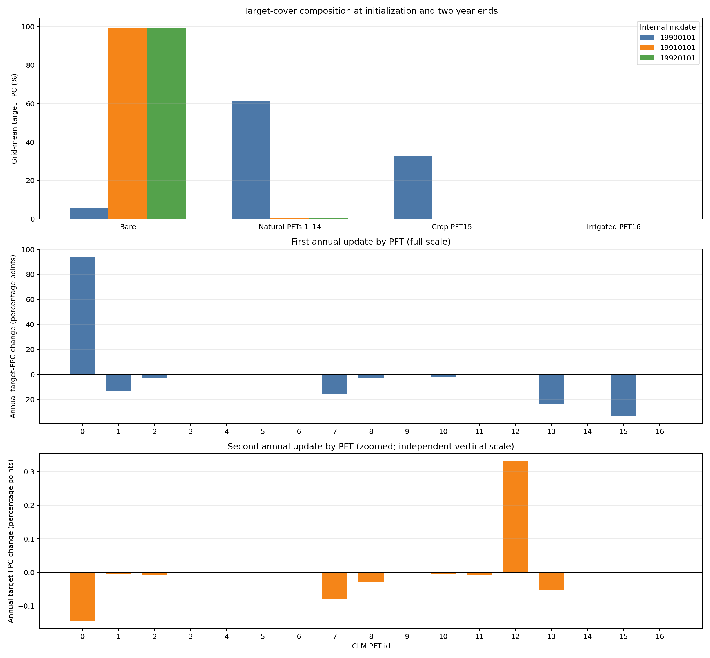
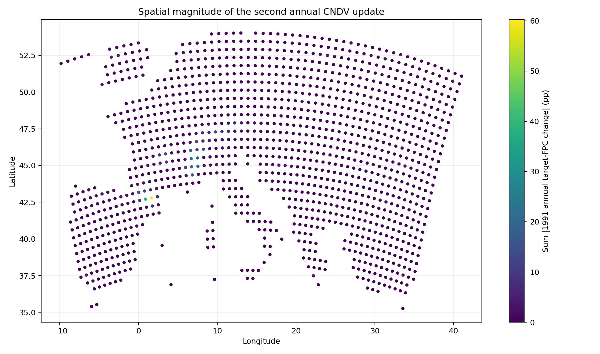

# RegCM5-CNDV 1990—1992 两整年连续测试报告

## 技术摘要

**第二个完整年份应该跑，而且现已完成。** 1991 年从经过校验的 1991-01-01
restart 连续积分至 1992-01-01，Slurm 作业 `39249855` 使用 1 节点、32 MPI，
`COMPLETED 0:0`。2920 个三小时时次严格连续，年末 CNDV 只调用一次且 `kyr=2`；
最终 HV、CLM restart 和年度增量逐槽一致，工程链路通过。

第二年末的自然 PFT 年度目标覆盖由 **0.45055% 增至 0.59416%**，裸地由
**99.54945% 降至 99.40584%**。这不是恢复到合理植被：净回升仅 0.14361 个百分点，
只抵消首年 61.09350 个百分点净损失的 0.235%；树和灌木仍继续下降，回升主要来自
PFT12 C3 北极草。因此结论是：**第二年更新没有继续发生首年同量级的整体塌缩，
但系统仍处在几乎全裸地的异常冷启动轨迹，不能作科学气候响应解释。**

欧洲测试域的 PFT4 热带常绿阔叶树在三个时点均为零，故本试验仍不能验证新增的
“20 年递推干旱均值超过 45 天时限制 PFT4”规则。下一阶段不宜机械地继续追加一年；
优先工作应是建立科学一致的 CNDV spin-up/初始碳库、处理作物边界，并在含 PFT4
的热带域做多年试验。

## 两次年度更新的量级已经明显分离

下图上部展示初始、第一年末和第二年末的目标覆盖组成；中、下两个面板采用独立
纵轴，分别展示第一次和第二次年度更新。独立尺度是必要的：第二年全部自然 PFT
绝对变化总量只有首年的 1.07%，若共用首年纵轴会看不到第二年结构变化。



区域值是 1311 个有效 soil gridcell 的非面积加权平均。`FPCGRID` 单位为百分比，
PFT0—16 在每个 soil gridcell 上合计 100%。

| 组成 | 1990-01-01 初始 | 1991-01-01 第一年度更新后 | 1992-01-01 第二年度更新后 | 第二年变化 |
| --- | ---: | ---: | ---: | ---: |
| 裸地 PFT0 | 5.46555% | 99.54945% | 99.40584% | −0.14361 pp |
| 自然 PFT1—14 | 61.54405% | 0.45055% | 0.59416% | +0.14361 pp |
| 作物 PFT15 | 32.99040% | 0 | 0 | 0 |
| 灌溉作物 PFT16 | 0 | 0 | 0 | 0 |
| 树 PFT1—8 | 34.03592% | 0.12296% | 0.00236% | −0.12060 pp |
| 灌木 PFT9—11 | 2.67277% | 0.01646% | 0.00233% | −0.01413 pp |
| 草 PFT12—14 | 24.83535% | 0.31112% | 0.58947% | +0.27834 pp |

第二年末残余自然覆盖中，草本占 99.21%，树和灌木合计只占 0.79%；PFT12 单独占
残余自然覆盖的 78.66%。这说明 0.14361 pp 的净回升是草本重组，不是整个植被群落
恢复。

## 第二年 PFT 变化集中在 PFT12 和少数格点

| PFT | 第二年区域平均变化 | 第二年末区域平均 FPC | 解释 |
| --- | ---: | ---: | --- |
| PFT12 C3 北极草 | +0.330108 pp | 0.467335% | 唯一显著净增加来源 |
| PFT7 温带落叶阔叶树 | −0.079296 pp | 0.001070% | 继续减少 |
| PFT13 非北极 C3 草 | −0.051764 pp | 0.122132% | 继续减少 |
| PFT8 寒带落叶阔叶树 | −0.027677 pp | 0.000858% | 继续减少 |
| PFT11 寒带落叶阔叶灌木 | −0.008318 pp | 0.000725% | 继续减少 |
| PFT2 寒带常绿针叶树 | −0.007188 pp | 0.000219% | 继续减少 |
| PFT1 温带常绿针叶树 | −0.006445 pp | 0.000142% | 继续减少 |
| PFT10 温带落叶阔叶灌木 | −0.005815 pp | 0.001604% | 继续减少 |

第二年共有 6717 / 18354 个自然 PFT 槽位出现大于 `1e-8` pp 的变化，其中
2941 个达到分析阈值 `0.01` pp。用年初和年末 restart 的精确 `present` 标志统计，
125 个槽位建立、41 个槽位消亡，存在槽位净增 84（6668 → 6752）。HV 本身不含
`present`；仅用 FPC/NIND 阈值会误报消亡，因此这里只采用 restart 精确值。

在两年都达到 0.01 pp 变化阈值的 2941 个槽位中，2714 个（92.28%）延续同一变化
方向，227 个（7.72%）反向。区域净覆盖略增并不等于大多数槽位反转；主要是少数
PFT12 增幅大于其他类型的持续损失。

空间上，第二年每格自然 PFT 绝对变化量的中位数为 0.190 pp，P95 为 1.827 pp。
117 个格点超过 1 pp、31 个超过 5 pp、16 个超过 10 pp、4 个超过 20 pp，仅 1 个
超过 50 pp。最大热点位于 gridcell 344（42.7945°N, 1.6489°E）：总绝对变化
60.3026 pp，其中 PFT12 从 6.4886% 增至 65.0011%，贡献 +58.5125 pp。

下图使用线性色标保留该极值，因此大部分低变化格点颜色接近色标下端；它用于判断
变化是否空间集中，不用于读取每个格点的微小差异。



主导自然 PFT 在 451 / 1311 个格点发生转换。但第二年自然覆盖区域均值只有 0.594%，
许多格点的“主导 PFT”只是极小残余中的最大值，不能据此解释优势植被带迁移。

## 试验范围、状态定义与比较基线

| 项目 | 配置 |
| --- | --- |
| 区域 | 欧洲小域，Lambert conformal |
| 网格 | `iy=34`, `jx=64`, `kz=18`, `ds=60 km` |
| 有效 soil gridcell | 1311 |
| 大气/SST | `EIN15` / `ERSST` |
| 首年 | 1990-01-01 至 1991-01-01，冷启动，8 MPI |
| 第二年 | 1991-01-01 至 1992-01-01，restart，32 MPI |
| 时间步 | 大气 `dt=150 s`，CLM `dtsrf=600 s` |
| CNDV 构建 | CLM4.5 + `CN` + `CNDV` |
| 模式二进制 revision | `1d8155c7c54ee775a6169f8ba8f581794c954ee8` |

本文的“第一年末”和“第二年末”指完成对应年度 CNDV 计算之后的年度目标状态：

| 内部日期 `mcdate` | 文件 | 含义 |
| --- | --- | --- |
| 19900101 | `hv.1991.nc` | 冷启动初始目标 |
| 19910101 | `hv.1992.nc` | 1990 年年度更新后目标 |
| 19920101 | `hv.1993.nc` | 1991 年年度更新后目标 |

文件名年份比内部日期大一是现有 `histCNDV` 命名规则；比较程序以 `mcdate` 和映射
数组为准。`FPCGRID` 是下一年度目标覆盖，实际耦合的 PFT 权重在随后一年内插，
不能用年末瞬时 `pfts1d_wtxy` 替代目标状态。

## 重启和年度状态通过了独立一致性检验

第二年使用首年末同一时刻的完整状态：

- `c5yr1990_SAV.1991010100.nc`；
- `c5yr1990.clm.regcm.r.1991010100.nc`；
- `c5yr1990.clm.regcm.rh0.1991010100.nc`；
- 关联的 `c5yr1990.clm.regcm.h0.199101.nc`。

DOMAIN、CLM surface 及上述状态复制前后的 SHA-256 完全相同，运行后也未被覆盖。
第二年保持原始 `mdate0=1990010100`，设置 `mdate1=1991010100`、
`mdate2=1992010100`；日志明确显示 `run type = restart`、成功读取 CLM restart，且
没有再次出现 `Writing initial CNDV FPCGRID`。

| QA 项 | 结果 |
| --- | --- |
| Slurm | `COMPLETED 0:0`，35 分 49 秒 |
| MPI 分解 | 32 MPI，`8 × 4`，1 节点 |
| 模式内部耗时 | 2099.7202 秒 |
| 三小时状态时次 | 2920；1991-01-01 03:00 至 1992-01-01 00:00 |
| 时间缺口/重复 | 0 / 0 |
| 年度 CNDV 调用 | 恰好 1 次，`kyr=2` |
| 月度 SAV/CLM restart/history 写出 | 各 12 次 |
| FATAL / NaN / Inf / MPI abort / SIGSEGV | 0 |
| 三份 HV 的映射数组 | 完全一致 |
| 逐格 PFT0—16 覆盖度闭合最大误差 | `4.2633e-14` pp 以下 |
| 第二年末 HV vs restart FPC/NIND 最大差 | 0 / 0 |
| `100*(fpcgrid-fpcgridold)` vs HV 年度差最大误差 | 0 pp |
| 年初 restart vs 第一年度 HV FPC/NIND 最大差 | 0 / 0 |
| 年末 `drought_days` | 1311 个 active-soil column 全部为 0 |

首年 8 MPI 的模式内部耗时为 3941.915 秒；第二年 32 MPI 为 2099.720 秒。不同年份
负载不是严格基准，但观测墙钟加速约 1.88 倍，远低于 MPI 数增加的 4 倍。对这个
64×34 小网格继续增至 128 MPI 很可能由通信和 I/O 主导，故没有盲目使用 2×64。

第二年最终关键文件：

| 文件 | 字节 | SHA-256 |
| --- | ---: | --- |
| `c5yr1990.clm.regcm.hv.1993.nc` | 1,053,230 | `a14d74fedb4e2008bc4ad9481030e7bf6896e126afb9ace3a3cffbc973509035` |
| `c5yr1990_SAV.1992010100.nc` | 12,800,148 | `945acad26cc67153d10755bc6506cd3540e22f6a011dece6f468ead4aa65b0fb` |
| `c5yr1990.clm.regcm.r.1992010100.nc` | 50,682,250 | `e39a492e8d4a71cbeac1aeab8c8e5a19032fdf3d49aa70a9cd70b959f067fb3d` |
| `c5yr1990.clm.regcm.rh0.1992010100.nc` | 198,804 | `8b8d6dc5a4f600488139cfdb2f7046eb2fe5f49635ddc17db68bdf2abbcc6c9e` |

第二年输出目录共 65 个文件，占用约 794 MiB。

## 干旱状态连续且符合当前 19/20 递推实现

1992-01-01 的月历史文件在 `dv()` 之前记录 1991 年累计干旱日数，最终 restart 在
`dv()` 之后记录更新后的 `drought_days20` 并把 `drought_days` 清零。active-soil
column 与 history grid 的坐标逐点一致。

| 指标 | 第一年度更新后 | 1991 年当年累计（更新前） | 第二年度更新后 |
| --- | ---: | ---: | ---: |
| 均值 | 31.4762 天 | 52.7766 天 | 32.5412 天 |
| 中位数 | 15.3681 天 | 36.1597 天 | 17.1986 天 |
| P95 | 142.0660 天 | 164.7292 天 | 138.5017 天 |
| 最大值 | 352.5694 天 | 362.4722 天 | 351.3726 天 |
| 超过 45 天的 column | 240 | 543 | 241 |

按代码公式逐 column 复算：

```text
第二年度 drought_days20 = (19 × 第一年度 drought_days20 + 1991 drought_days) / 20
```

最大绝对差为 `6.78e-7` 天，来自 history 单精度写出；restart 双精度状态与实现一致。
注意这是一阶递推均值，不是保存 20 个年度样本的严格滑动窗口，而且从首年就开始
生效。PFT4 在本域为零，因此即使 241 个 column 超过阈值也无法验证 PFT4 淘汰。

## 为什么结果仍不能作科学结论

1. **冷启动状态远未平衡。** 第一次年度更新把自然覆盖从 61.54% 降至 0.45%；
   第二年只回升 0.14 pp。两年不足以判断碳氮库、LAI、NPP 和植被结构收敛。
2. **作物边界不适合本区域科学试验。** 当前 CNDV 强制
   `create_crop_landunit=.false.`，而建立代码明确说明现有动态植被不能模拟 crop
   PFT；初始 32.99% 的 PFT15 在首年归零。欧洲含大量作物的 surface 初值因此不是
   干净的自然植被验证样本。
3. **第二年净增加由单一草本类型和少数热点驱动。** 它不能证明群落恢复；树木目标
   覆盖仍由 0.1230% 降至 0.0024%。
4. **没有无 CNDV 对照和既有实现对照。** 本试验验证执行、保存和内部一致性，不能
   将异常变化归因到某一条新增科学改动。
5. **欧洲域缺少 PFT4。** ModifiedDV 的目标对象没有样本；热带测试仍是必需项。

因此本轮的两级结论为：

- 工程验收：**通过**；
- 科学可信度验收：**不通过，需重新设计初始化和 spin-up**。

## 推荐下一步不是盲目追加第三年

1. 建立可重复的 CNDV spin-up：循环一致 forcing，保存完整 SAV/r/rh，监控植被碳、
   土壤碳氮、NPP/GPP、LAI、FPC、NIND、水量和能量守恒，按收敛而非固定年数停止。
2. 单独审计作物处理：使用适合 CNDV 的自然植被 surface 或明确的 crop-to-natural
   映射；不要把 PFT15 首年归零误解释为气候死亡。
3. 保存年度死亡、建立、竞争和碳库诊断，以区分首年覆盖塌缩来自初始化、生产力、
   气候适生性还是竞争/死亡路径。
4. 建立包含非零 PFT4 的热带小域，至少跨多个完整年度和 restart，检查 45 天阈值
   两侧的生存/建立响应。
5. 在相同输入、时间和分解下做原始 CLM4.5-CN、旧 CNDV 参考实现与新版 CNDV 的
   A/B 对照；只有这样才能归因新增代码的影响。

如果仅为软件回归测试，可以继续跑第三年；如果目标是论文级科学验证，应先完成上述
初始化和对照设计，否则追加年份只会延长一条已知异常轨迹。

## 可复现资产与作业记录

测试配置和分析代码位于
[`Testing/CNDV/regcm5_1990_1992`](../Testing/CNDV/regcm5_1990_1992/)，逐 PFT
精确数值见
[`regcm5_1990_1992_pft_three_state_by_type.csv`](cndv-test-assets/regcm5_1990_1992_pft_three_state_by_type.csv)，
成对 QA 摘要见
[`regcm5_1991_pft_change_summary.txt`](cndv-test-assets/regcm5_1991_pft_change_summary.txt)。

服务器目录：

```text
/public/home/elpt_2024_000795/workdir_for_RCM/cndv_crossyear_regcm5_1990
/public/home/elpt_2024_000795/workdir_for_RCM/cndv_year2_regcm5_1991
```

作业链：

| 作业 | 用途 | 状态 | 耗时 |
| --- | --- | --- | ---: |
| `39249854` | 1991 SST/ICBC 前处理 | COMPLETED 0:0 | 00:06:06 |
| `39249855` | 1991 全年、32 MPI | COMPLETED 0:0 | 00:35:49 |
| `39249856` | 初始分析 | COMPLETED 0:0 | 00:00:08 |
| `39250464` | 动态日期和分面图复算 | COMPLETED 0:0 | 00:00:11 |
| `39250468` | 精确 `present` 复算 | COMPLETED 0:0 | 数秒 |

本地和服务器分别运行同一 Python 分析器，数值 CSV 完全一致。图表已检查标题、日期、
单位、零线和独立纵轴标注；空间图保留完整线性色标。报告日期：2026-09-06。
