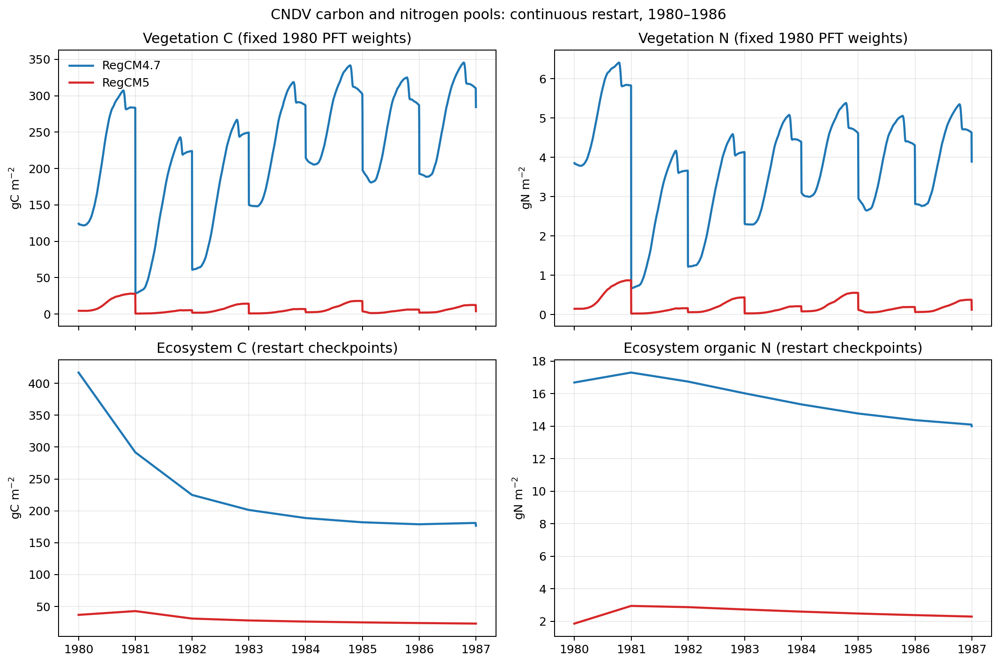
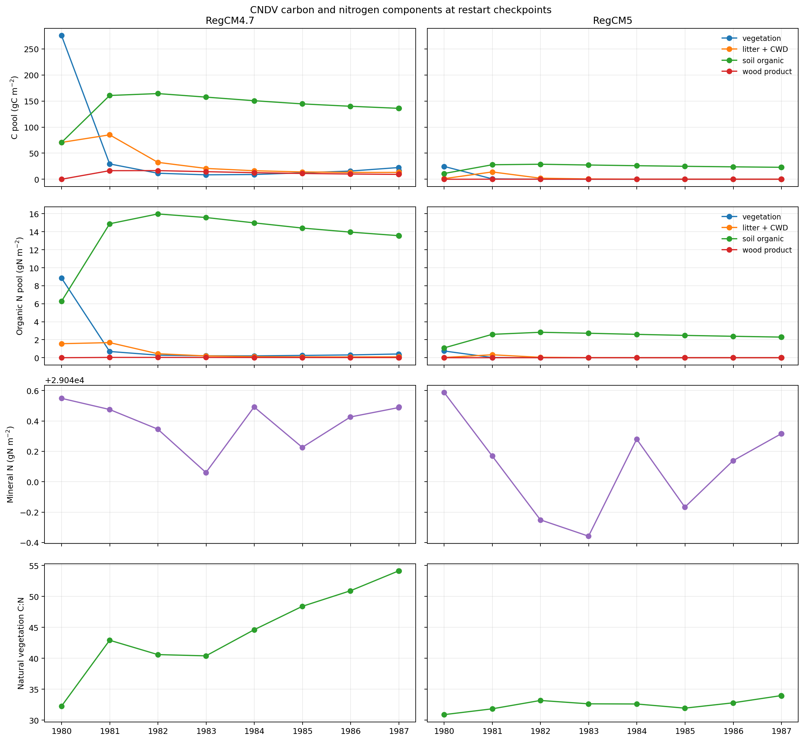
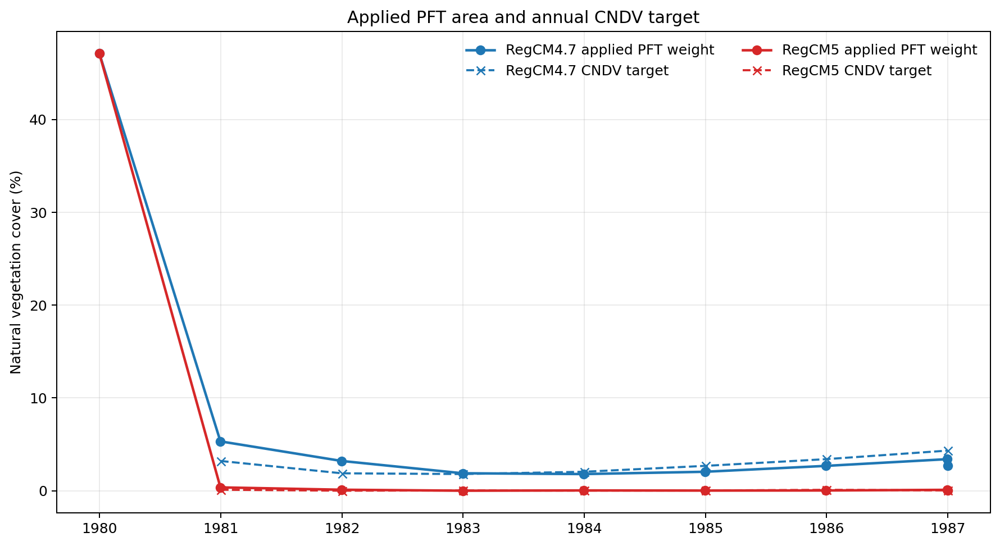

# RegCM4.7/RegCM5 CNDV 1980–1987 连续积分与碳氮库对比报告

报告日期：2026-09-24

## 2026-09-28 复核更正

以下结果与记录数保留用于工程追溯，但已确认两版都有相同的非化学氮沉降单位错误：
输入地表文件的年氮沉降率被当作每秒通量使用，放大约 3,156 万倍。
本报告的“初始矿质 N”指 **1980 年接续 restart 的状态**，不是 1979 年冷启动
代码设定；后者为零。因此此前巨大矿质氮和缺少氮限制的解释需要修订，不能只归因于
初始库设定过大或缺少自旋。

这两条连续积分轨迹在错误氮输入条件下生成，不能作为正常碳氮输入的多年植被科学
验证，也不能仅清零矿质氮后作为合格自旋初态继续。新的隔离对照与证据边界见
[氮沉降单位验证报告](../ndep_unit_validation_1979/NDEP_UNIT_VALIDATION_REPORT_ZH.md)。

## 1. 结论

两版均从各自的 `1980-01-01 00:00` 完整重启状态连续积分到
`1987-01-01 00:00`，不是逐年冷启动或独立年份拼接。每版都完成 7 次年度 CNDV
计算，逐日分析各有 2,557 个连续记录，年记录数依次为
366、365、365、365、366、365、365，9 个完整 restart 检查点齐全。

两版结果**不一致，而且不是到 1980–1986 年间某个较晚时刻才开始分歧**。两版
1980-01-01 接续 restart 中的植被碳氮库已经明显不同；第一个共同逐日输出
1980-01-02 也已经不同。因此本试验比较的是两条版本轨迹，不是从同一数值状态出发的
位级差异试验。

主要结果如下：

| 指标 | RegCM4.7-CNDV | RegCM5-CNDV |
|---|---:|---:|
| 初始植被 C（gC m⁻²） | 124.6542 | 4.4723 |
| restart 检查点最小植被 C | 8.4947（1982-12-31） | 0.01321（1983-12-31） |
| 最终植被 C（gC m⁻²） | 16.4972 | 0.03971 |
| 初始至最终植被 C 变化 | −86.77% | −99.11% |
| 初始植被 N（gN m⁻²） | 3.86562 | 0.14482 |
| restart 检查点最小植被 N | 0.20405（1983-12-31） | 0.000405（1983-12-31） |
| 最终植被 N（gN m⁻²） | 0.30482 | 0.001171 |
| 初始至最终植被 N 变化 | −92.11% | −99.19% |
| 初始至最终生态系统 C | 416.9438 → 176.5912（−57.65%） | 36.8033 → 23.0915（−37.26%） |
| 初始至最终生态系统有机 N | 16.6804 → 13.9934（−16.11%） | 1.86223 → 2.29350（+23.16%） |
| 初始至最终矿质 N | 29040.5489 → 29040.4928（−0.00019%） | 29040.5878 → 29040.3156（−0.00094%） |
| 最终自然植被实际覆盖权重 | 2.6875% | 0.03451% |
| 1987 年度 CNDV 目标覆盖 | 4.3316% | 0.03819% |

1987-01-01 时，RegCM5 植被 C 仅为 RegCM4.7 的 0.2407%，植被 N 为
0.3841%，生态系统 C 为 13.08%，生态系统有机 N 为 16.39%。包含巨大 `SMINN`
初值的总生态系统 N 却达到 RegCM4.7 的 99.959%，这个“接近”由矿质氮库支配，
不能据此判断植被状态一致。

## 2. 试验设计与可比性

两版使用相同的 `34 × 64` 区域、`cndvab` 域名、共同地形/侧边界/SST 输入目录、
`ERSST`、积分日期、150 秒动力时间步、辐射频率、边界方案、对流方案和陆面方案。
规范化 namelist 的差异只剩 RegCM4.7 中存在、RegCM5 namelist 中没有的
`idesseas=0` 和 `iconvlwp=0` 两项，以及注释；两版都从各自的 1979 连续积分结果
接续。两版 1980-01-01 的自然 PFT 覆盖权重同为 47.1391%，但碳氮状态不相同。

共同外强迫并不意味着耦合模式内部的气温、降水和土壤水分逐日相同。以下量由共同的
1980 初始自然 PFT 权重加权，仅用作过程诊断：

| 1980–1986 诊断 | RegCM4.7 | RegCM5 | RegCM5−RegCM4.7 |
|---|---:|---:|---:|
| 日均近地气温（°C） | 11.266 | 11.525 | +0.259 |
| 全期日最低温（°C） | −7.393 | −6.315 | +1.079 |
| 全期日最高温（°C） | 25.793 | 25.895 | +0.102 |
| 年均降水（mm yr⁻¹） | 531.88 | 523.45 | −8.42（−1.58%） |

逐年冬季日最低/夏季日最高及降水如下：

| 年 | RegCM4.7 冬季最低/夏季最高（°C） | RegCM5 冬季最低/夏季最高（°C） | RegCM4.7/RegCM5 降水（mm） |
|---|---:|---:|---:|
| 1980 | −6.162 / 24.741 | −5.392 / 25.121 | 575.57 / 539.19 |
| 1981 | −3.935 / 24.683 | −2.944 / 24.713 | 558.23 / 580.10 |
| 1982 | −3.326 / 24.207 | −2.144 / 24.017 | 517.79 / 517.97 |
| 1983 | −3.608 / 25.201 | −2.759 / 25.493 | 527.52 / 509.52 |
| 1984 | −3.492 / 24.427 | −3.240 / 24.426 | 558.38 / 543.16 |
| 1985 | −7.393 / 25.684 | −6.315 / 25.820 | 491.59 / 481.60 |
| 1986 | −6.040 / 25.793 | −5.587 / 25.895 | 494.05 / 492.65 |

这说明两组试验区域和外部气象边界相同，但陆气耦合后的局地气候并非完全相同。
温度与降水差异远小于植被 C/N 的数量级差异；结合接续初态已经不同的事实，不能把
植被差异简单归因于某一年气温或降水。

## 3. 植被碳氮和覆盖的年际演变

下表使用每个完整 restart 自身保存的当时 PFT 权重，是动态区域植被状态的权威比较：

| 检查点 | R4.7 植被 C | R4.7 植被 N | R4.7 FPC | R5 植被 C | R5 植被 N | R5 FPC |
|---|---:|---:|---:|---:|---:|---:|
| 1980-01-01 | 124.6542 | 3.86562 | 47.139% | 4.47229 | 0.144817 | 47.139% |
| 1980-12-31 | 28.6569 | 0.667817 | 5.324% | 0.353861 | 0.011119 | 0.3669% |
| 1981-12-31 | 11.5528 | 0.284624 | 3.216% | 0.067148 | 0.002024 | 0.1150% |
| 1982-12-31 | 8.49468 | 0.210344 | 1.888% | 0.015031 | 0.000461 | 0.01016% |
| 1983-12-31 | 9.10107 | 0.204048 | 1.803% | 0.013210 | 0.000405 | 0.03873% |
| 1984-12-30 | 12.3548 | 0.255335 | 2.049% | 0.028413 | 0.000890 | 0.02351% |
| 1985-12-30 | 15.7444 | 0.309289 | 2.684% | 0.057830 | 0.001764 | 0.03445% |
| 1986-12-30 | 22.4626 | 0.415100 | 3.408% | 0.107791 | 0.003174 | 0.10285% |
| 1987-01-01 | 16.4972 | 0.304817 | 2.687% | 0.039712 | 0.001171 | 0.03451% |

RegCM4.7 的植被 C 在 1982 年末触底，植被 N 在 1983 年末触底；到 1987-01-01，
相对最低检查点分别恢复 94.2% 和 49.4%。RegCM5 的 C/N 都在 1983 年末触底，
相对最低点分别恢复 200.6% 和 189.0%，但绝对量仍极低。

1986-12-30 到 1987-01-01 的植被 C/N 下跳与年度覆盖调整同步。RegCM4.7 植被 C
下降约 26.6%，但生态系统 C 只下降约 2.45%；RegCM5 植被 C 下降约 63.2%，
生态系统 C 只下降约 0.20%。这表明区域加权植被量的突变主要是覆盖权重更新，不能
解释为两天内对应数量的碳氮物质被直接销毁。

年度 `hv` 中的 `FPCGRID` 表示 CNDV 目标覆盖，restart 中的 `pfts1d_wtxy` 表示
检查点实际覆盖。两者存在年度更新时滞和振荡；1987 年 RegCM4.7 实际/目标为
2.687%/4.332%，RegCM5 为 0.03451%/0.03819%。两版 CNDV 对自然植被覆盖的响应
明显不同。







## 4. 日序列与 restart 序列不能混用

多年 history 中的 `pfts1d_wtgcell` 没有时间维，文件内的值不能恢复每次 CNDV
调整后的历史面积。逐日曲线因此固定使用两版各自 1980-01-01 restart 的 PFT 权重，
用于比较季节过程、通量闭合和首次逐日差异；不能把它当作随 CNDV 面积变化后的区域
总量。动态区域 C/N、FPC 和生态系统库结论全部来自 9 个完整 restart 检查点。

逐日 NPP 与 `GPP−AR` 的最大绝对闭合残差为 RegCM4.7 的
`1.10×10⁻¹³ gC m⁻² s⁻¹` 和 RegCM5 的 `1.86×10⁻¹⁴ gC m⁻² s⁻¹`，在数值精度
范围内闭合。完整表见 [`results/daily_carbon_nitrogen_pools.csv`](results/daily_carbon_nitrogen_pools.csv)
与 [`results/restart_carbon_nitrogen_checkpoints.csv`](results/restart_carbon_nitrogen_checkpoints.csv)。

## 5. RegCM4.7 历史文件修复及依据

原始 RegCM4.7 长积分在 `savfrq=365` 周期 restart 后继续写 CLM history 时报告
`NetCDF: Variable not found`。原因是历史文件在周期存档点被关闭，而旧代码仅在该点
同时为月末时重新打开：

```fortran
! 旧逻辑
if ( .not. if_stop .and. nlomon ) then

! 修复逻辑，与 RegCM5 一致
if ( .not. if_stop ) then
```

修改位置为 `Main/clmlib/clm4.5/mod_clm_histfile.F90`。该修改只修正所有非最终存档点
之后的历史文件关闭/重开生命周期，不改变时间步进、物理方程、CNDV 算法、碳氮状态
或输出变量。对应 RegCM4.7 提交为 `a2dd429527ad00a8f97bf3b888dc5aa016061ad9`。

验证包括：

- 每日 restart 压力试验完成 31 次 CLM 重启写出，无 NetCDF 错误；
- 压力试验和常规一个月 smoke 的 CLM restart 与 RegCM `SAV` 逐变量完全一致，
  只忽略保存路径元数据 `locfnh/locfnhr`；
- 原失败长积分和修复积分在首个原故障检查点 1980-12-31 的 CLM restart/SAV 数值状态
  也完全一致；
- 修复积分继续跨过 1981-01-01 年度 CNDV 更新并完整到达 1987-01-01。

因此原故障属于 I/O 生命周期问题，不是 CNDV 数值状态失稳；此修复没有人为改写碳氮库。

## 6. 科学解释边界

本试验接续的是 1979 冷启动定位试验，不是达到平衡的 CN/CNDV spin-up。1980 年的
巨大下降同时包含冷启动调整、版本此前已形成的状态差异和第一次强烈覆盖调整，不能
单独解释为真实植被退化。7 年结果可以证明年累积状态被连续传递、可以定位极小值和
恢复阶段，但还不能宣称长期平衡或气候学趋势。

两版初始 `SMINN` 区域均值约 `2.904×10⁴ gN m⁻²`，远大于植被和有机氮库。
报告因此将有机 N 与矿质 N 分开；含 `SMINN` 的总生态系统 N 不适合作为版本优劣或
氮限制强弱的单一指标。下一步若进行几十年科学生产试验，应先建立一致、可解释的
CN/CNDV spin-up，并保存年度 restart 权重和 `FPCGRID`，再用多成员试验量化气候内部
变率。

## 7. 可复核产物

- 汇总 JSON：[`results/carbon_nitrogen_summary.json`](results/carbon_nitrogen_summary.json)
- 年度表：[`results/annual_carbon_nitrogen_summary.csv`](results/annual_carbon_nitrogen_summary.csv)
- 年度覆盖目标：[`results/annual_cndv_fpc_targets.csv`](results/annual_cndv_fpc_targets.csv)
- restart 检查点：[`results/restart_carbon_nitrogen_checkpoints.csv`](results/restart_carbon_nitrogen_checkpoints.csv)
- 完整逐日表：[`results/daily_carbon_nitrogen_pools.csv`](results/daily_carbon_nitrogen_pools.csv)
- 单位定义：[`results/units.json`](results/units.json)
- 结果哈希：[`results/result_sha256.txt`](results/result_sha256.txt)
- 服务器验证证据：[SERVER_VALIDATION_EVIDENCE_ZH.md](SERVER_VALIDATION_EVIDENCE_ZH.md)
