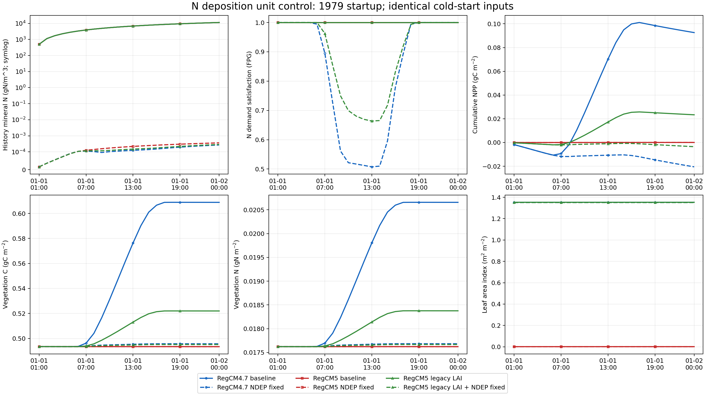
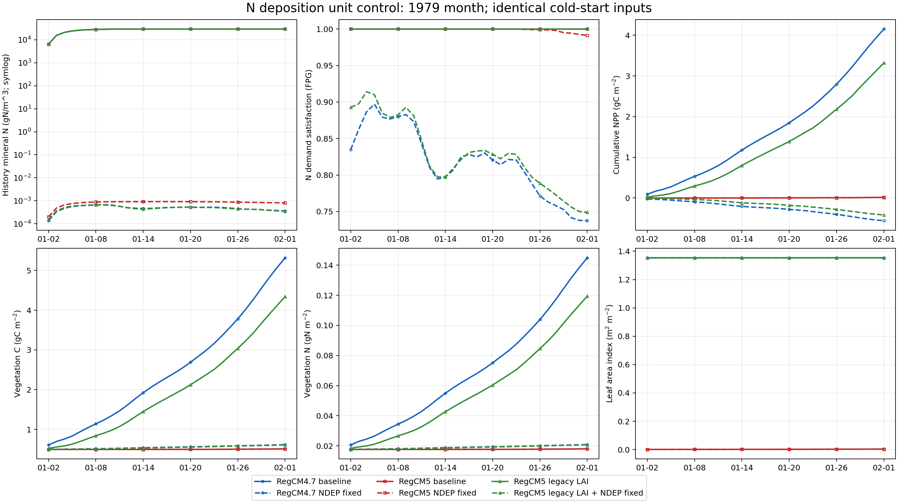

# RegCM4.7 / RegCM5 CNDV 氮沉降单位与碳氮反馈验证报告

日期：2026-09-28。结论范围：同域、同输入、同冷启动的一天逐小时与一个月逐日
对照；RegCM4.7 是较早的独立版本，不是 RegCM5 的分支。

## 1. 核心结论

本轮完成了 6 个方案 × 2 个时段的 12 组模型试验，每组使用 2 节点 × 64 MPI。
两个版本的候选程序均编译成功，全部模型和分析作业正常结束，独立原始 NetCDF
复算通过。**输入单位错误及其短期碳氮反馈已验证；年度 CNDV、多年平衡和生态系统
总碳氮守恒尚未验收。**

1. 两版共有明确的氮沉降单位错误。实际 surface 的 `NDEP` 是
   `g(N)/m2/yr`，非化学分支却直接作为 `gN/m2/s` 使用；本次 Gregorian 配置下
   输入被放大 **31,556,926.08 倍**。这不是根据巨大氮库猜测，而是输入文件、
   执行代码链路、实际输出通量和 Fortran 子程序测试相互对应的证据。
2. 冷启动代码的矿质氮设为零。原版运行一天后 restart 矿质氮已约
   `1.1564×10⁴ gN/m²`，一个月后约 `2.9041×10⁴ gN/m²`；修正后分别只有
   `10⁻⁴` 和 `10⁻⁴—10⁻³ gN/m²` 量级。因此旧测试中的巨大矿质氮不能称为
   “冷启动设定过大”，也不能仅靠重新设初值处理。
3. 原先“氮限制不明显”的结论有重要适用条件：它是在异常高氮输入下得到的。
   修正后 RegCM4.7 第一天的区域平均 `FPG` 最低记录为 `0.5074`，一月份
   累计 GPP 从 `7.1199` 降为 `0.96091 gC/m²`，下降 **86.50%**；累计 NPP
   从 `+4.15336` 变为 `−0.55714 gC/m²`。
4. **共同氮输入错误并不是第一小时 LAI 分歧的直接来源。** 在正确氮输入下，
   两版第 1 小时叶碳、植被总碳和总氮仍一致到约 `10⁻⁹` 相对精度，而 LAI 仍为
   RegCM4.7 的 `1.35295` 对 RegCM5 的 `0.00103366`。给 RegCM5 只换旧 LAI
   公式仍能恢复这一 LAI，证实原来的公式定位结论。
5. 氮输入与 LAI 有明显交互作用。正确氮输入下，RegCM5 原 LAI 的一月 GPP 仅
   下降 `2.66%`，但带旧 LAI 的 RegCM5 下降 `86.56%`，NPP 同样转负。因此
   不能只用高氮条件下的 LAI 消融数字解释正常氮输入下的植被生产力。
6. 没有覆盖任何基线程序，也没有正式启用旧 LAI 区域调参。主源码保持原状，
   候选修改以两个版本各自的补丁和隔离程序保存。

对“是否是碳氮造成植被差异”的准确回答是：**异常氮输入确实显著改变碳氮库和
生长，并放大了与 LAI 相关的生产力差距；但两个版本最早的 LAI 分歧来自不同的
leafC→LAI 公式，而非不同的植被碳氮初值。** 水分胁迫和耦合气象仍有剩余差异，
本轮不能给出多年差距的全部归因。

## 2. 单位修正依据

实际地表文件为：

`/public/home/elpt_2024_000795/workdir_for_RCM/cndv_maxrun_regcm47_regcm5_1979_2016/common_input/cndvab_CLM45_surface.nc`

1193 个陆地格点的 `NDEP` 最小、均值、最大分别为：

| 量 | gN m⁻² yr⁻¹ |
|---|---:|
| 最小 | 0.02094160842925 |
| 均值 | 0.16808491552337634 |
| 最大 | 0.3237824826559064 |

非化学通路的正确每秒均值为：

`0.16808491552337634 / (86400 × 365.2422) = 5.3264033099188455×10⁻⁹ gN m⁻² s⁻¹`

候选修正仅为：

```fortran
ndep_to_sminn(c) = ndep(c) / (secspday * dayspy)
```

同时引入已有常数 `secspday`。年率换算与同模块 `CNNFixation` 的日历约定一致。
化学耦合的 `forc_ndep` 已是每秒率，保持原样。没有修改固氮、淋失、C/N 分配、
初始碳氮库、PFT 覆盖或年度 CNDV 算法。详细代码位置见
[代码证据](CODE_EVIDENCE_ZH.md)，完整候选改动见
[4.7 补丁](regcm47_ndep_units.patch) 与 [5 补丁](regcm5_ndep_units.patch)。

实测区域平均累计氮沉降输入如下；它是通量积分，不等于最终留在土壤中的全部氮：

| 时段 | 原版输入（gN m⁻²） | 单位修正后输入（gN m⁻²） |
|---|---:|---:|
| 24 小时 | 14,522.53671 | 0.000460201246 |
| 31 天 | 450,198.63803 | 0.014266238612 |

Gregorian 年率约定使用 365.2422 天，因此 31 天积分为年率乘 `31/365.2422`。
输出精度造成的微小差别在验证容差内。

## 3. 试验控制与指标定义

方案：4.7 原版、4.7 只修 NDEP；5 原版、5 只修 NDEP、5 只换 4.7 LAI、
5 同时修 NDEP 和换旧 LAI。

- 每个方案独立从 1979-01-01 00:00 冷启动；不是先运行一天再从该状态接着跑一个月。
- 一天试验积分到 1979-01-02 00:00，24 条逐小时记录；月试验积分到
  1979-02-01 00:00，31 条逐日记录。每段内部连续积分。
- 使用相同 `34×64` 区域、DOMAIN、CLM surface、ICBC、SST 和共同物理配置，
  `ichem=0`、`calendar='gregorian'`、动力步长 150 秒、陆面步长 600 秒。
- 本月不跨年度 CNDV 更新，history 中静态 PFT 权重可用于本时段过程比较。
  相同外部边界不意味着两个耦合模式内部的温度、降水、水分胁迫逐时相同。
- 植被 C/N、GPP/NPP、LAI 是自然 PFT 1—14 按 `pfts1d_wtgcell` 加权、除以
  1193 个格点的贡献均值，不是再除以自然植被面积的均值。
- `FPG` 是格点氮需求满足系数的区域平均；表中最小值是这些小时/日记录的最小值，
  不是所有格点、所有内部时间步的绝对最小值。`DOWNREG` 按自然 PFT 权重聚合。
- history `SMINN` 元数据为 **gN/m³**；表中 restart 矿质氮以土壤/作物 column
  的 `cols1d_wtxy` 加权后得到 **gN/m²** 贡献均值。二者没有混为同一变量。
  本报告的区域均值没有另做地理面积权重修正。

## 4. 一天逐小时结果

GPP/NPP 为 24 小时累计量；C、N、LAI 和矿质氮为段末状态。

| 方案 | 累计 GPP（gC/m²） | 累计 NPP（gC/m²） | 植被 C（gC/m²） | 植被 N（gN/m²） | 最低平均 FPG | restart 矿质 N（gN/m²） |
|---|---:|---:|---:|---:|---:|---:|
| 4.7 原版 | 0.167166 | +0.0926023 | 0.608848 | 0.0206574 | 1.0000 | 11563.9375 |
| 4.7 修 NDEP | 0.0200652 | −0.0205044 | 0.495720 | 0.0176836 | 0.5074 | 0.000274590 |
| 5 原版 | 0.0000774450 | +0.0000392012 | 0.493422 | 0.0176219 | 1.0000 | 11563.9420 |
| 5 修 NDEP | 0.0000774450 | +0.0000392012 | 0.493422 | 0.0176219 | 1.0000 | 0.000367394 |
| 5 旧 LAI | 0.0409948 | +0.0233487 | 0.521978 | 0.0183762 | 1.0000 | 11563.9406 |
| 5 旧 LAI + 修 NDEP | 0.00607278 | −0.00350480 | 0.495121 | 0.0176671 | 0.6637 | 0.000293753 |

正确氮输入下第 1 小时：

| 指标 | 4.7 修 NDEP | 5 修 NDEP | 5 旧 LAI + 修 NDEP |
|---|---:|---:|---:|
| LEAFC（gC/m²） | 0.1065108413 | 0.1065108409 | 0.1065108409 |
| TOTVEGC（gC/m²） | 0.4934742933 | 0.4934742932 | 0.4934742929 |
| TOTVEGN（gN/m²） | 0.01762260410 | 0.01762260409 | 0.01762260408 |
| TLAI | 1.3529542004 | 0.00103365737 | 1.3529542004 |

因此“同叶碳、不同 LAI 公式”的直接原因在正确氮输入下仍成立。但稍后的氮限制
不再可以忽略：4.7 的最大 PFT 加权 `DOWNREG` 达到 0.2381，旧 LAI + 修 NDEP
的 RegCM5 达到 0.1635；原版则均在浮点零附近。



## 5. 一个月逐日结果

| 方案 | 累计 GPP（gC/m²） | 累计 NPP（gC/m²） | 植被 C（gC/m²） | 植被 N（gN/m²） | 最低平均 FPG | restart 矿质 N（gN/m²） |
|---|---:|---:|---:|---:|---:|---:|
| 4.7 原版 | 7.119873 | +4.153355 | 5.319919 | 0.144892 | 1.0000 | 29040.6599 |
| 4.7 修 NDEP | 0.960906 | −0.557139 | 0.613440 | 0.0208761 | 0.7374 | 0.000403705 |
| 5 原版 | 0.0256226 | +0.0154719 | 0.507844 | 0.0180336 | 1.0000 | 29040.6864 |
| 5 修 NDEP | 0.0249413 | +0.0149487 | 0.507321 | 0.0180189 | 0.9913 | 0.000812377 |
| 5 旧 LAI | 5.645780 | +3.321472 | 4.342994 | 0.119404 | 1.0000 | 29040.6628 |
| 5 旧 LAI + 修 NDEP | 0.758895 | −0.415091 | 0.607325 | 0.0207248 | 0.7489 | 0.000391368 |

4.7 修正后段末植被 C/N 分别是原版的 11.53% / 14.41%。RegCM5 使用原 LAI
时，月 NPP 仅下降 3.38%；加入旧 LAI 后，氮输入修正带来的生产力抑制就与 4.7
相近。这个受控比较证明了氮输入与 LAI 的交互，不能把其效果简单线性相加。

两版都修 NDEP 后仍不一致：RegCM5 原 LAI 的 GPP 为 4.7 的 2.596%，段末 LAI
为 0.2515%。RegCM5 同时用旧 LAI 后，一月 GPP 达到 4.7 修正版的 78.98%，
段末 C/N 达到 99.00% / 99.28%，但 `BTRAN` 只有 88.34%。这不是证明两版等价，
也不是以恢复 4.7 数值为唯一正确性标准；两者仍有耦合和生理响应差别。



图中实线为未修 NDEP，虚线为修正后；蓝色为 4.7、红色为 5 原 LAI、绿色为 5
旧 LAI。矿质氮面板使用 symlog（线性阈值 10⁻⁴）；其余面板使用线性刻度。
LAI 的接近重合与 GPP/NPP 的不重合均是真实输出，不是遗漏曲线。

### 为什么负 NPP 时 TOTVEGC 仍可增加？

`TOTVEGC` 不是全部 PFT 碳记账量。两版 `mod_clm_cnsummary.F90` 第 974—977 行
明确为 `totpftc=totvegc+xsmrpool+pft_ctrunc`。月末 4.7 修正版 `XSMRPOOL` 为
`−0.681029 gC/m²`，5 双改方案为 `−0.532685 gC/m²`；它们没有计入表中的
`TOTVEGC`。前者 `TOTVEGC+XSMRPOOL=−0.0675885`，后者为 `+0.0746397 gC/m²`。
这些只是已输出记账分量的和，尚未包含截断库、全部损失和生态系统其他库，不能
据此宣称完成了完整质量守恒核算。

负 NPP 和负维持呼吸记账库进一步说明这仍是冷启动过程试验，不是经过平衡自旋的
健康植被状态。不能因为 LAI 下限使 LAI 维持较高，就认为生物量和碳收支正常。

## 6. 验证记录与未验收部分

已完成：

- 直接抽取两版真实 `CNNDeposition` 并用 gfortran 编译执行，验证 Gregorian、
  noleap、360_day 的年率积分、零输入、化学通路及 column→gridcell 映射；全部通过。
- 12 组全部时刻和记录数校验：共 144 条小时记录、186 条日记录；无缺失或重复时刻。
- 所有记录的 NDEP 通量都与实际 surface 及日历换算对应。
- `NPP=GPP−AR` 通量恒等式通过，最大区域平均误差约 `2.29×10⁻¹⁴ gC/m²/s`。
- 另一套不调用原聚合函数的原始 NetCDF 计算，复算所有 12 组的氮输入、FPG 最小
  记录值、累计 NPP、最终 C/N/LAI 和 restart 矿质氮；全部通过。
- 新旧两版基线的 24 小时输出各对比 1608 个共同数值，差异均为零，原定位试验可重复。
- 已检查源码类型（F90/f90/C/H/inc）的校验表确认：4.7 实验副本只有 NDEP 模块变化；5 最终双改副本只有 NDEP
  模块和旧 LAI 模块变化。基线源文件与本地子程序测试源的校验值一致。

尚未验收，不能由上述“通过”推出：

- 1 月内没有年度 CNDV 更新，尚未证明修正后的年累计量如何改变跨年 FPC/NIND。
- 没有完成新的多年碳氮平衡自旋，也没有给出正常氮输入下几十年植被轨迹。
- 两版总碳氮守恒报错条件含 `.and. 1==2`，原本就不会触发；本次未改变该开关。
  NPP 恒等式及正常结束不等于生态系统质量守恒验收。
- 化学通路只完成子程序映射/不重复换算检查，没有做完整化学耦合模式运行。
- 4.7 旧 LAI 含区域调参与硬下限；本次没有证明它对当前区域更真实。

按数据验证规范，本轮可以确认单位修正和短期受控对照结果；多年植被的科学结论
仍须附带上述限制。已在旧的
[1979 定位报告](../precise_onset_1979/PRECISION_LOCALIZATION_REPORT_ZH.md) 和
[1980—1987 连续积分报告](../cn_followon_1980_1987/CONTINUOUS_CN_1980_1987_REPORT_ZH.md)
添加更正，保留原始数据作为错误通路下的工程追溯资料。

## 7. 后续初始化和长期验证建议

先修正外部氮输入，再评估初始化；不应给土壤填入巨大矿质氮来维持旧的生产力。
也不应给 RegCM5 强行添加旧 LAI 最小值来追平 4.7。

下一阶段应在独立目录从可信地表与碳氮初态开始：先验证修正版跨年累计与 CNDV
更新，再用一致的气候循环进行碳氮自旋，同时跟踪植被/土壤 C、植被/有机/矿质 N、
氮输入与输出、NPP、呼吸记账库、FPC/NIND。自旋是否合格应按漂移和收支判据判断，
不能仅按运行了多少年判断。确认有效的自旋控制和诊断能力后再做长期科学积分。
这是根据本地耦合代码和本轮对照提出的后续验证流程，不是宣称已经复现了 CLM
官方自旋方案。官方在线文档本次未能取得；RegCM 中自旋开关的实际可用性与参数
仍需通过本耦合实现核验，不能直接套用其他 CLM 版本的 namelist。

旧错误输入下的 restart 已包含异常生长、库分配、植被覆盖与陆气反馈历史。即使
仅将矿质氮清零，也无法撤销这些历史，因此不能直接作为修正后的合格初态。
本轮未对旧状态作手工修补，也未启动新的多年科学积分。

## 8. 文件、程序与实际作业

服务器隔离目录：

`/public/home/elpt_2024_000795/workdir_for_RCM/cndv_ndep_unit_validation_1979`

候选程序保存在其 `bin/`：`regcm47_ndepfix`、`regcm5_ndepfix`、
`regcm5_lai47_ndepfix`。原安装目录的程序保留。

| 作业 | 一天 | 一个月 |
|---|---:|---:|
| 4.7 原版 | 39717928 | 39717929 |
| 4.7 修 NDEP | 39717930 | 39717931 |
| 5 原版 | 39717932 | 39717933 |
| 5 修 NDEP | 39717934 | 39717935 |
| 5 旧 LAI | 39717936 | 39717937 |
| 5 旧 LAI + 修 NDEP | 39717938 | 39717939 |

构建作业为 39717923 / 39717924；分析作业为 39717940。15 个作业全部
`COMPLETED`、退出码 `0:0`；模型作业均为 `cpu_parallel`、128 核、2 节点。

关键可复核资料：

- [逐小时 CSV](results/startup_regional_timeseries.csv)、
  [逐日 CSV](results/month_regional_timeseries.csv)、两类 `comparison_long.csv`；
- [模型结果汇总](results/ndep_validation_summary.json)、
  [独立原始结果复算](results/independent_output_checks.json)、
  [下载归档与基线复现核对](results/archive_audit_summary.json)；
- [字段单位](results/history_units.json)、[实际配置](results/namelists/)、
  [作业状态](results/job_status.psv)、[正常结束记录](results/run_completion_receipt.txt)；
- `results/*source_sha256.txt`、`*source_change.diff`、`all_executable_sha256.txt`、
  `final_definition_sha256.txt`、`final_result_sha256.txt`，以及地表文件在汇总中的 SHA256；
- [Fortran 子程序测试](fortran_deposition_test.json) 和所有构建、运行、分析脚本。

原始 NetCDF 留在服务器各方案的 `output/`，不将大型运行文件纳入 Git；候选补丁、
全部试验代码、配置、数值摘要、图和说明分别归档到两个独立版本仓库用于版本管理。
